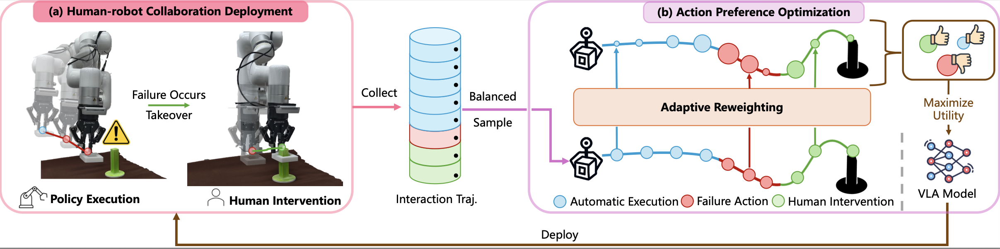

# [NeurIPS 2025] Human-assisted Action Policy Optimization

[Project Page](https://xwinks.github.io/human_assisted_preference_optimization/) 

[Arxiv](https://arxiv.org/abs/2506.07127)




## Introduction

In this work, we propose a human-assisted action policy optimization (HAPO) method to correct interaction failure and achieve stable optimization for Vision-Language-Action (VLA) models.

## Installation

To install the dependencies for training, run the following command:
```bash
pip install -r requirements.txt
```

To install the dependencies for inference, please install the following packages:

### MimicGen Installation
```
mkdir deps
cd ${project_path}/deps
git clone https://github.com/NVlabs/mimicgen.git
cd mimicgen
pip install -e .
```
### Robosuite Installation
```
cd ${project_path}/deps
git clone https://github.com/ARISE-Initiative/robosuite.git
cd robosuite
git checkout b9d8d3de5e3dfd1724f4a0e6555246c460407daa
pip install -e .
```

### Robomimic Installation
```
cd ${project_path}/deps
git clone https://github.com/ARISE-Initiative/robomimic.git
cd robomimic
git checkout d0b37cf214bd24fb590d182edb6384333f67b661
pip install -e .
```
### Robosuite_task_zoo Installation
```
cd ${project_path}/deps
git clone https://github.com/ARISE-Initiative/robosuite-task-zoo
cd robosuite-task-zoo
git checkout 74eab7f88214c21ca1ae8617c2b2f8d19718a9ed
pip install -e .
```

### Flash-Attn Installation
```
pip install packaging ninja
ninja --version; echo $?
pip install "flash-attn==2.5.5" --no-build-isolation
```
## Training

To train the HAPO model, run the following command:
```bash
bash scripts/hapo_train.sh ${task_name}
```

In this work, we evaluate the performance of the HAPO model on the MimicGen dataset.

## Inference

To evaluate the performance of the HAPO model, run the following command:
```bash
bash scripts/inference.sh ${task_name} ${adapter_path}
```

## Citation

```bibtex
@article{xia2025robotic,
  title={Robotic Policy Learning via Human-assisted Action Preference Optimization},
  author={Xia, Wenke and Yang, Yichu and Wu, Hongtao and Ma, Xiao and Kong, Tao and Hu, Di},
  journal={arXiv preprint arXiv:2506.07127},
  year={2025}
}
```
